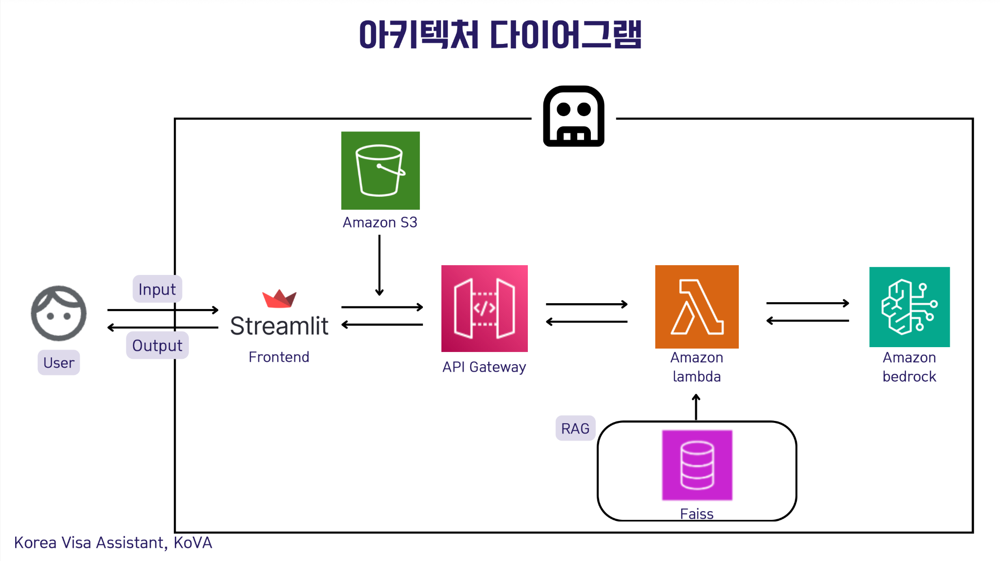

# Korea Visa AI Assistant (KoVA)

## 🚀 Project Overview
**Korea Visa Assistant (KoVA)** is an AI chatbot service built on AWS that uses a RAG (Retrieval-Augmented Generation) architecture to recommend the optimal Korean visa type for each user and guide them through the application process and required documents.

- **Event**: AWS Solve-A-Thon 2025  
- **Date**: January 22, 2025  
- **Award**: Grand Prize 🏆  

## 👥 Team Information
- **Team Name**: Solvethon Team 11  
- **Members**: Junhee Kim, Hyunjun Kim, Soyeon Moon, Hyunjune So  

## 🔍 Key Features
- **Personalized Visa Matching**  
  - Filters 37 main visa categories (100+ subtypes) based on user profile (education, work experience, intended stay duration, etc.)  
- **Conversational Interface**  
  - Streamlit front-end collects user queries and displays answers generated by AWS Bedrock LLM  
- **RAG (Retrieval-Augmented Generation)**  
  - Stores official visa regulations/documents in S3, indexes them in Faiss, retrieves relevant passages to augment LLM prompts  
- **Actionable Roadmap**  
  - If the user does not yet meet eligibility, provides a step-by-step strategy and preparation roadmap  

## 🏗️ Architecture

1. **Streamlit Frontend**  
   - Receives user input → calls API Gateway → displays response  
2. **API Gateway**  
   - Routes HTTP requests to AWS Lambda  
3. **AWS Lambda**  
   - Implements business logic  
   - Calls Amazon Bedrock LLM  
   - Queries Faiss vector index for RAG  
4. **Amazon Bedrock**  
   - Hosts and serves the large language model  
5. **Amazon S3**  
   - Stores source documents (PDFs, regulations)  
6. **Faiss**  
   - Embeds S3 documents and performs vector search  

## ⚙️ Installation & Usage

Configure AWS resources
   - Create an S3 bucket and upload visa regulation documents
   - Deploy Lambda function and API Gateway, grant Bedrock invoke permissions
   - Initialize Faiss index with build_faiss_index.py

## Run the local frontend
streamlit run app.py

## 📑 Presentation Materials

